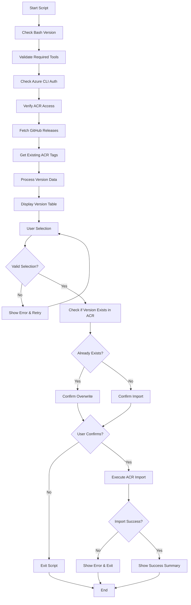
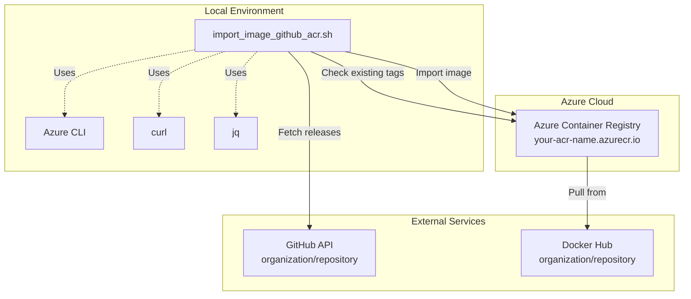
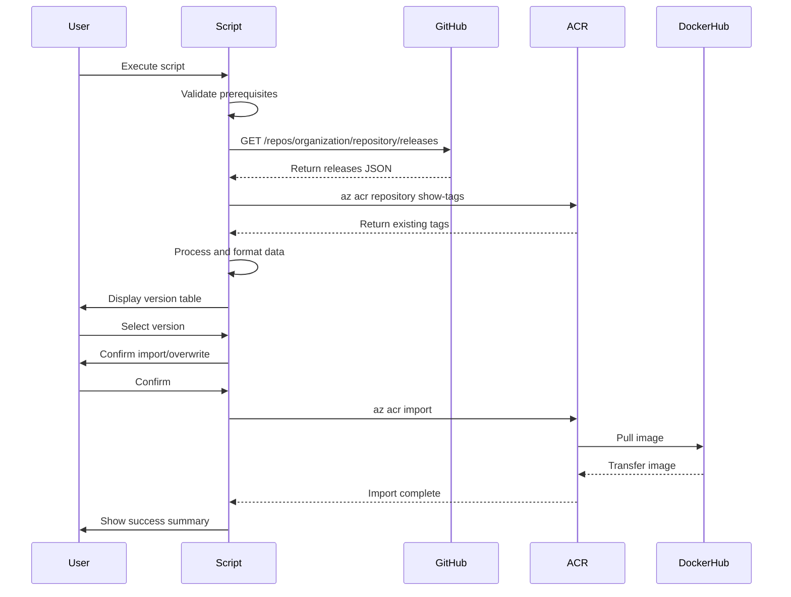
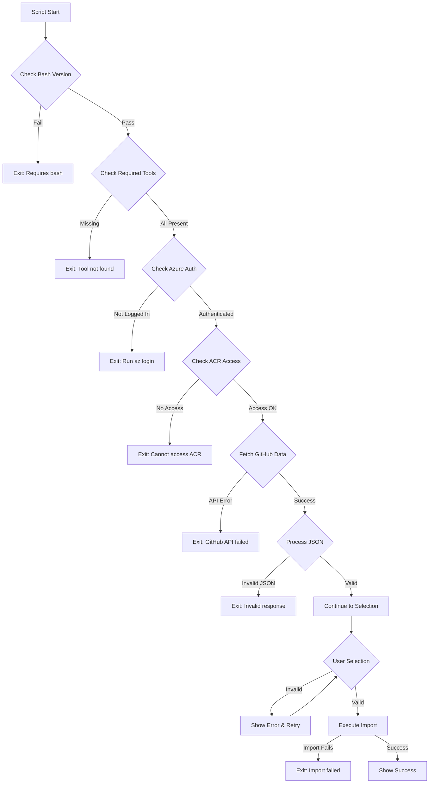
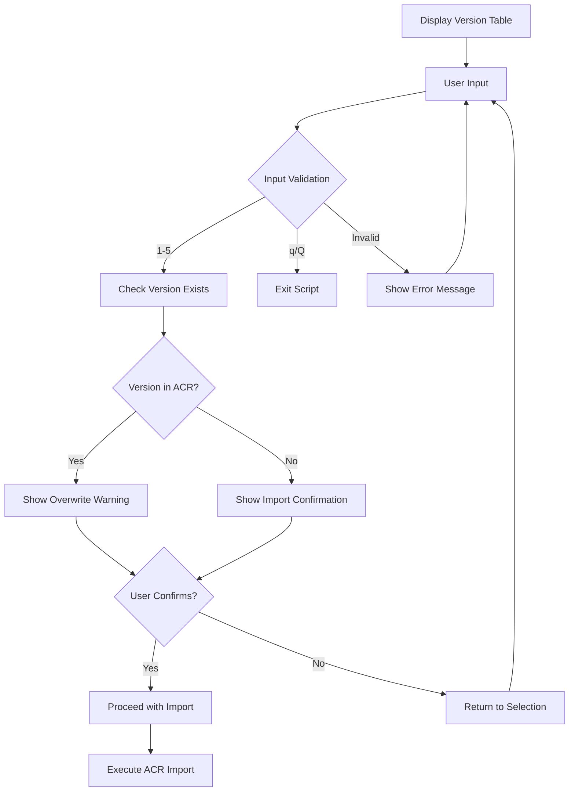
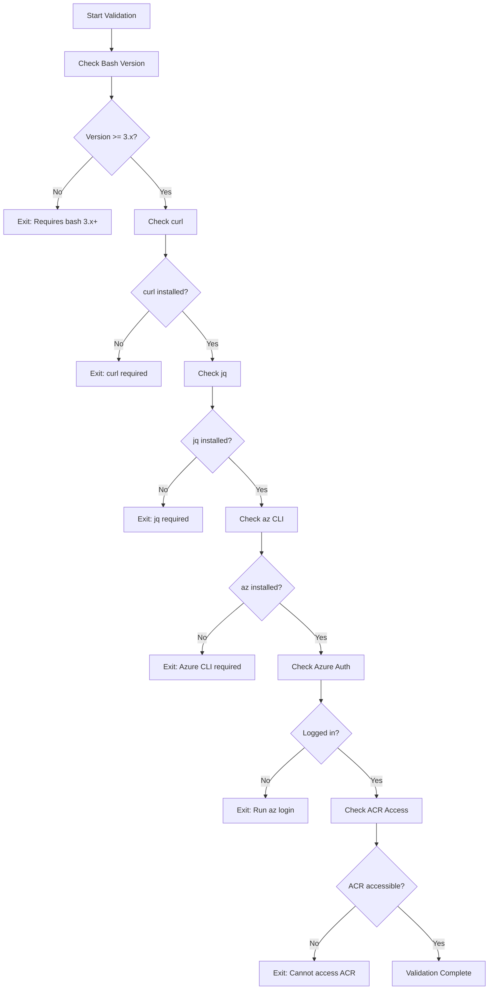

# Workflow Diagrams

## Script Execution Flow

```mermaid
flowchart TD
    A[Start Script] --> B[Check Bash Version]
    B --> C[Validate Required Tools]
    C --> D[Check Azure CLI Auth]
    D --> E[Verify ACR Access]
    E --> F[Fetch GitHub Releases]
    F --> G[Get Existing ACR Tags]
    G --> H[Process Version Data]
    H --> I[Display Version Table]
    I --> J[User Selection]
    J --> K{Valid Selection?}
    K -->|No| L[Show Error & Retry]
    L --> J
    K -->|Yes| M[Check if Version Exists in ACR]
    M --> N{Already Exists?}
    N -->|Yes| O[Confirm Overwrite]
    N -->|No| P[Confirm Import]
    O --> Q{User Confirms?}
    P --> Q
    Q -->|No| R[Exit Script]
    Q -->|Yes| S[Execute ACR Import]
    S --> T{Import Success?}
    T -->|No| U[Show Error & Exit]
    T -->|Yes| V[Show Success Summary]
    V --> W[End]
    R --> W
    U --> W
```

## System Architecture

```mermaid
graph TB
    subgraph "External Services"
        GH[GitHub API<br/>organization/repository]
        DH[Docker Hub<br/>organization/repository]
    end
    
    subgraph "Azure Cloud"
        ACR[Azure Container Registry<br/>your-acr-name.azurecr.io]
    end
    
    subgraph "Local Environment"
        SCRIPT[import_image_github_acr.sh]
        AZCLI[Azure CLI]
        CURL[curl]
        JQ[jq]
    end
    
    SCRIPT -->|Fetch releases| GH
    SCRIPT -->|Check existing tags| ACR
    SCRIPT -->|Import image| ACR
    ACR -->|Pull from| DH
    
    SCRIPT -.->|Uses| AZCLI
    SCRIPT -.->|Uses| CURL
    SCRIPT -.->|Uses| JQ
```

## Data Flow

```mermaid
sequenceDiagram
    participant User
    participant Script
    participant GitHub
    participant ACR
    participant DockerHub
    
    User->>Script: Execute script
    Script->>Script: Validate prerequisites
    Script->>GitHub: GET /repos/organization/repository/releases
    GitHub-->>Script: Return releases JSON
    Script->>ACR: az acr repository show-tags
    ACR-->>Script: Return existing tags
    Script->>Script: Process and format data
    Script->>User: Display version table
    User->>Script: Select version
    Script->>User: Confirm import/overwrite
    User->>Script: Confirm
    Script->>ACR: az acr import
    ACR->>DockerHub: Pull image
    DockerHub-->>ACR: Transfer image
    ACR-->>Script: Import complete
    Script->>User: Show success summary
```

## Error Handling Flow

```mermaid
flowchart TD
    A[Script Start] --> B{Check Bash Version}
    B -->|Fail| C[Exit: Requires bash]
    B -->|Pass| D{Check Required Tools}
    D -->|Missing| E[Exit: Tool not found]
    D -->|All Present| F{Check Azure Auth}
    F -->|Not Logged In| G[Exit: Run az login]
    F -->|Authenticated| H{Check ACR Access}
    H -->|No Access| I[Exit: Cannot access ACR]
    H -->|Access OK| J{Fetch GitHub Data}
    J -->|API Error| K[Exit: GitHub API failed]
    J -->|Success| L{Process JSON}
    L -->|Invalid JSON| M[Exit: Invalid response]
    L -->|Valid| N[Continue to Selection]
    N --> O{User Selection}
    O -->|Invalid| P[Show Error & Retry]
    P --> O
    O -->|Valid| Q[Execute Import]
    Q -->|Import Fails| R[Exit: Import failed]
    Q -->|Success| S[Show Success]
```

## Version Selection Process

```mermaid
flowchart TD
    A[Display Version Table] --> B[User Input]
    B --> C{Input Validation}
    C -->|1-5| D[Check Version Exists]
    C -->|q/Q| E[Exit Script]
    C -->|Invalid| F[Show Error Message]
    F --> B
    D --> G{Version in ACR?}
    G -->|Yes| H[Show Overwrite Warning]
    G -->|No| I[Show Import Confirmation]
    H --> J{User Confirms?}
    I --> J
    J -->|Yes| K[Proceed with Import]
    J -->|No| L[Return to Selection]
    L --> B
    K --> M[Execute ACR Import]
```

## Prerequisites Validation

```mermaid
flowchart TD
    A[Start Validation] --> B[Check Bash Version]
    B --> C{Version >= 3.x?}
    C -->|No| D[Exit: Requires bash 3.x+]
    C -->|Yes| E[Check curl]
    E --> F{curl installed?}
    F -->|No| G[Exit: curl required]
    F -->|Yes| H[Check jq]
    H --> I{jq installed?}
    I -->|No| J[Exit: jq required]
    I -->|Yes| K[Check az CLI]
    K --> L{az installed?}
    L -->|No| M[Exit: Azure CLI required]
    L -->|Yes| N[Check Azure Auth]
    N --> O{Logged in?}
    O -->|No| P[Exit: Run az login]
    O -->|Yes| Q[Check ACR Access]
    Q --> R{ACR accessible?}
    R -->|No| S[Exit: Cannot access ACR]
    R -->|Yes| T[Validation Complete]
```
